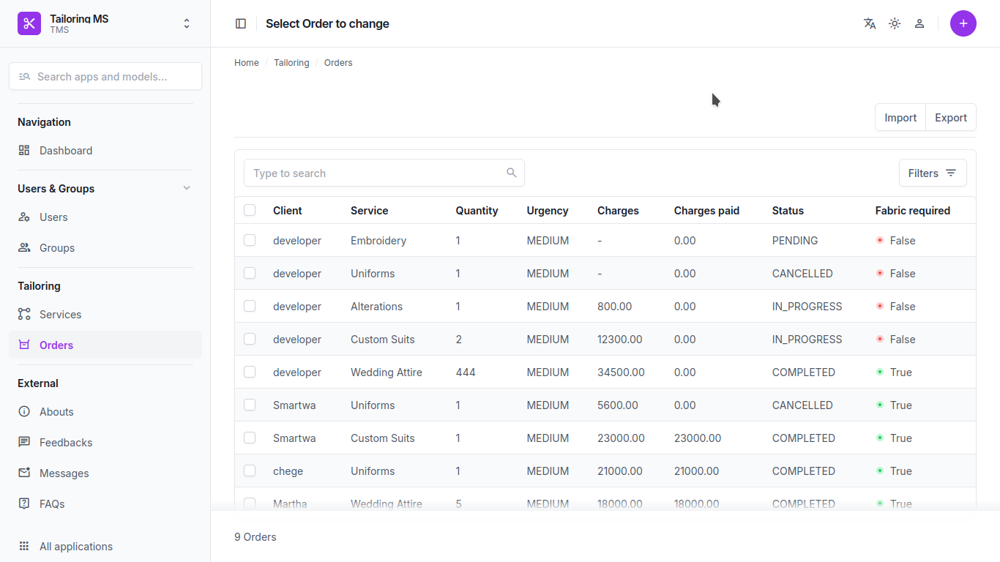
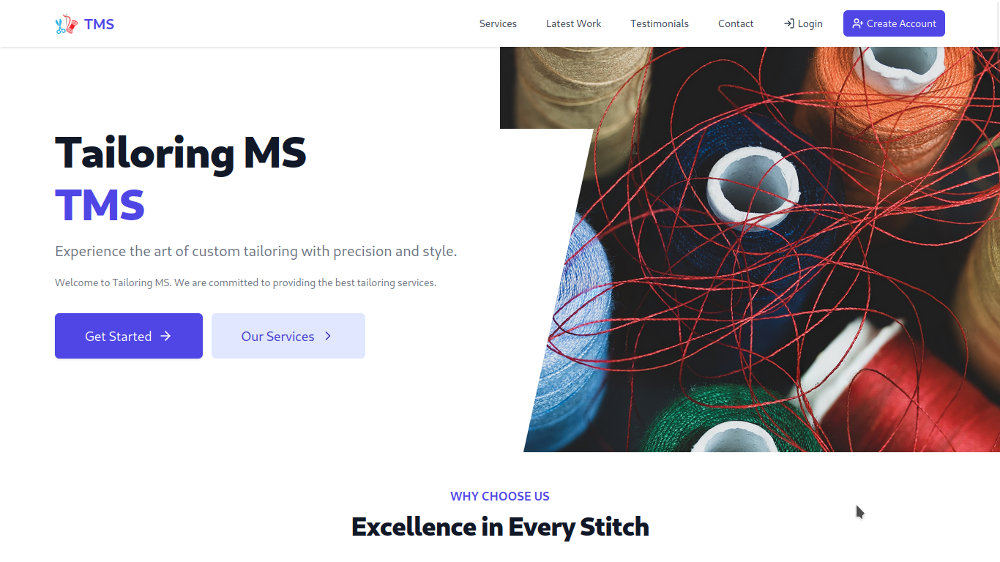
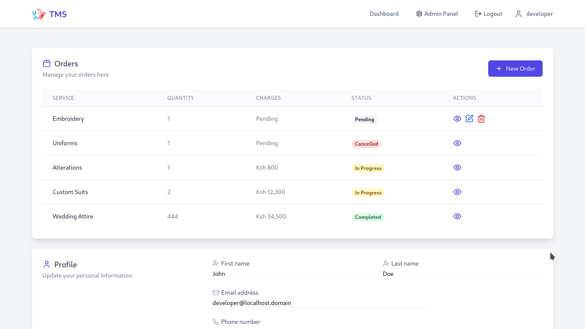

  <h1 align="center">Tailoring Management System  </h1>

<p align="center">
  <a href="#"></a>
  <a href="#"></a>
  <a href="#"></a>
  <a href="https://github.com/Simatwa/tailoring-management-system/blob/main/LICENSE"></a>
</p>

<p align="center">
A complete digital solution for tailoring businesses – manage services, receive orders, and allow clients to track their orders from the comfort of their screens.
</p>

---

<h1 align="center">🚀 Demonstrations</h1>

| Role     | Screenshot |
|----------|------------|
| **Admin Panel** |  |
| **Landing Page** |  |
| **User Dashboard** |  |

---

## 🛠 Technologies Used

- **Django** – Backend framework handling models, admin, and authentication.
- **FastAPI** – Lightweight, high-performance API layer.
- **React** – Frontend framework delivering a dynamic and responsive user experience.

---

## ✨ Key Features

- 🧾 Order placement & tracking  
- 🛠 Admin dashboard for managing services and users  
- 📋 Service listings  
- 🌟 Client feedback display  
- 💬 Direct messaging  
- ❓ FAQ section  

---

## ⚙️ Installation

> **Note**  
> Make sure you have [Python ≥ 3.13](https://www.python.org/) and [Git](https://git-scm.com/) installed.

```bash
# Clone the repository
git clone https://github.com/Simatwa/tailoring-management-system.git
cd tailoring-management-system/backend

# Create virtual environment
pip install virtualenv  # Skip if already installed
virtualenv venv

# Activate virtual environment
source venv/bin/activate        # For macOS/Linux
.\venv\Scripts\activate         # For Windows

# Install dependencies
pip install -r requirements.txt

# Set up Django
python manage.py makemigrations users hospital
python manage.py migrate
python manage.py collectstatic

# Create superuser (preset credentials)
python manage.py createsuperuser --username developer --email developer@localhost.domain --noinput

# Start FastAPI server
python -m fastapi run api
```

---

## 🌐 Site Endpoints

| Page | URL |
|------|-----|
| **Home** | `/` |
| **Admin Panel** | `/d/admin` |
| **API Docs (Swagger)** | `/api/docs` |
| **API Docs (ReDoc)** | `/api/redoc` |

> **Admin Credentials**  
> Username: `developer`  
> Password: `development`

---

## 🙏 Acknowledgement

Special thanks to **Miss Gatwiri** for funding and supporting the project, and for granting permission to open-source it.

---

## 🤝 Contributing

Pull requests are welcome! Feel free to suggest improvements, add features, or refactor any part of the codebase. Let's build this better together.

---

## 📄 License

This project is licensed under the [GPLv3 License](LICENSE).

---